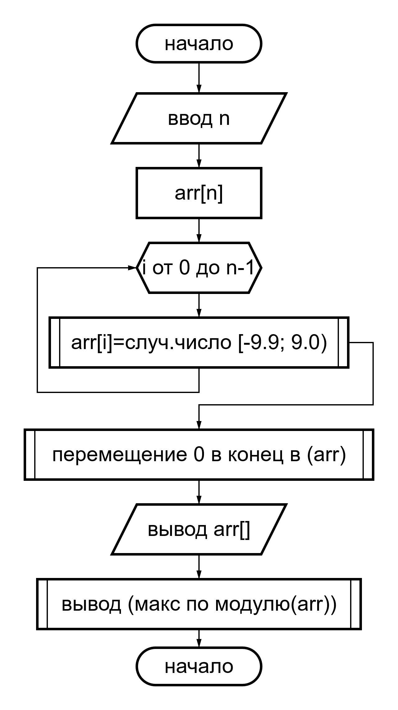
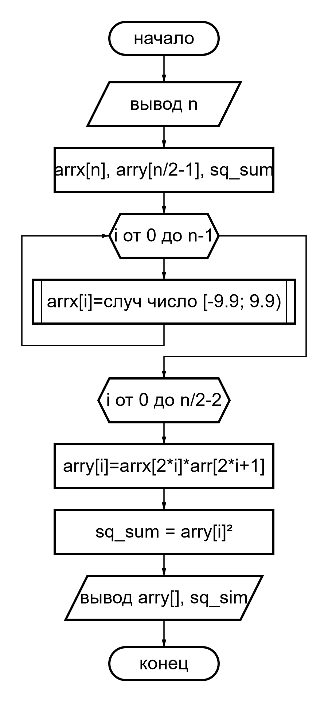

# Лабороторная 10
***Вариант 9***

## Задача 2

### Условие
В одномерном массиве, состоящем из n вещественных элементов, вычислить:
- максимальный по модулю элемент массива;
- преобразовать массив таким образом, чтобы элементы, равные нулю, располагались после всех остальных.

### Решение

#### Математическая модель 
Элементы вещественного одномерного динамического массива arr размером
сгенерируем датчиком псевдослучайных чисел в диапазоне [-10, 10].\

| Аргументы | Резултаты      |
| :-------- | :------------- |
| n         | arr[], abs_max |

#### Ввод ввыод
```
enter n: 12
arr:
 3.17, -2.88, -9.79, -9.47,  0.00,  0.00,  0.00,  0.00,  0.00,  0.00,  0.00,  0.00
abs max:
-9.79
```

#### Блок схема


#### Код
```c
#include <stdio.h>
#include <math.h>
#include <time.h>

typedef enum {CHAR, INT, FLOAT, DOUBLE} Type;

#define ull unsigned long long
#ifndef NULL
#define NULL ((void *)0)
#endif

#ifndef isdigit
#define isdigit(c) ((c) >= '0' && (c) <= '9')
#endif
#ifndef isspace
#define isspace(c) (((c)>9 && (c)<=13) || (c)==32)
#endif

#define floor(n, accur) ((double)(int)((n)*pow(10, (accur)))/pow(10, accur))
#define frand(low, high) ((low)+(double)rand()/RAND_MAX*((high)-(low)))
#define init_rf_arr(arr, size, accur, low, high)                               \
    do {                                                                       \
        int i;                                                                 \
        for (i = 0; i < (size); ++i)                                           \
            arr[i] = rand()%2 ? (floor(frand((low), (high)), accur)) : 0;      \
    } while (0)

#define print_farr(arr, size, accur)                                           \
    do {                                                                       \
        int i;                                                                 \
        printf(#arr ":\n");                                                    \
        for (i = 0; i < (size); ++i)                                           \
            printf((i == (size)-1) ? ("% ." #accur "lf\n")                     \
                                   : ("% ." #accur "lf, "),                    \
                   arr[i]);                                                    \
    } while (0)

#define swap(T, a, b)                                                          \
    do {                                                                       \
        T temp = (a);                                                          \
        (a) = (b);                                                             \
        (b) = temp;                                                            \
    } while (0)

#define mv_zero_to_end(T, arr, arr_size)                                       \
    do {                                                                       \
        int i, j;                                                              \
        for (j = 1; j < (arr_size); ++j)                                       \
            for (i = 0; i < (arr_size)-j; ++i)                                 \
                if ((arr)[i] == 0)                                             \
                    swap(T, (arr)[i], (arr)[i + 1]);                           \
    } while (0)

#ifdef _INC_STDLIB
#define new(T, size) (T *)malloc(sizeof(T)*(ull)(size)) /*syntax sugar*/
#else
#define NEXT_TYPE long long
#define RAND_TYPE short /*RAND_TYPE <= NEXT_TYPE for more "random" results */
#define NEXT_SIZE sizeof(NEXT_TYPE)
#define RAND_MAX_SIZE sizeof(RAND_TYPE)
#define RAND_MAX ((1ull<<(RAND_MAX_SIZE)*8)-1)
#define HALF_SHIFT ((NEXT_SIZE*8-RAND_MAX_SIZE*8)/2) /*narrowing the range of "NEXT" to "RANDOM"*/
static unsigned NEXT_TYPE next = 1;
void srand(unsigned RAND_TYPE seed) {
    next = seed;
} 
void srand(unsigned RAND_TYPE seed);
#define srand(init) srand((unsigned RAND_TYPE)(init))
unsigned RAND_TYPE rand(void);

void *alloc(ull n);
void free(void *ptr);
#define new(T, size) (T *)alloc(sizeof(T)*(ull)(size))
#endif

#define ACCUR 2

void *find_max_abs(Type type, void *arr, int arr_size);
int sget_int(char *start_msg, char *repeat_msg);

int main(void) {
    int arr_size;                                                                 // arr_size <=> n
    srand((unsigned)time(NULL));                                                  // rand func init
    double *arr = new (double, arr_size = sget_int("enter n: ", "try again"));    // mem alloc
    init_rf_arr(arr, arr_size, ACCUR, -9.9, 9.9);                                 // arr init random float
    mv_zero_to_end(double, arr, arr_size);                                        // move zero to end
    print_farr(arr, arr_size, 2 /*2<=>ACCUR*/);
    printf("abs max:\n% .2lf\n", *(double *)find_max_abs(DOUBLE, arr, arr_size)); // primt abs max
    free(arr);                                                                    // free mem
    return 0;
}

#define abs(a) ((a) < 0 ? -(a) : (a))
#define macro(T, arrptr, maxptr)                                               \
    do {                                                                       \
        int i;                                                                 \
        for (maxptr = arrptr, i = 1; i < arr_size; ++i)                        \
            if (abs(*((T *)arrptr + i)) > abs(*(T *)maxptr))                   \
                maxptr = (T *)arrptr + i;                                      \
    } while (0)

void *find_max_abs(Type type, void *arr, int arr_size) {
    void *max;
    switch (type) {
    case CHAR:
        macro(char, arr, max);
        break;
    case INT:
        macro(int, arr, max);
        break;
    case FLOAT:
        macro(float, arr, max);
        break;
    case DOUBLE:
        macro(double, arr, max);
        break;
    }
    return max;
}
#undef macro

int get_int(int *res) {
    int c, isdig, start, sign;
    sign = 0;
    c=getchar();
    if (c=='+'||c=='-') {
        sign=c=='-'?-1:1;
        c=getchar();
    }
    for (*res=0, isdig=start=1; c!='\n'; c=getchar()) {
        if (isdig && (isdig=isdigit(c)))
            *res=*res*10+c-'0';
        start=0;
    }
    *res *= *res ? (sign?sign:1) : 1;
    return !(sign==-1 && !*res) && isdig && !start;
}

int sget_int(char *start_msg, char *repeat_msg) {
    int res;
    printf("%s", start_msg);
    while (!get_int(&res))
        printf("%s", repeat_msg);
    return res;
}

#ifndef _INC_STDLIB
unsigned RAND_TYPE rand(void) {
    next = next * 1103515245 + 12345;
    return (unsigned RAND_TYPE)(next<<HALF_SHIFT>>HALF_SHIFT>>HALF_SHIFT)%(RAND_MAX+1);
}

#define ALLOCSIZE 1000

static char allocbuff[ALLOCSIZE];
static char *allocp = allocbuff;

void *alloc(ull n) {
    return (allocp + n <= allocbuff + ALLOCSIZE) ? (allocp+=n)-n : NULL;
}

void free(void *ptr) {
    if ((char *)ptr >= allocbuff && (char *)ptr < allocbuff + ALLOCSIZE)
        allocp = (char*)ptr;
    else
        printf("free: out of allocbuff");
}
#endif

```

## Задача 3

### Условие:
Элементы вещественного одномерного динамического массива х размером
n > 20 сгенерированы датчиком псевдослучайных чисел в диапазоне [-10, 10].
Сформировать массив y по формуле и выполнить указанные вычисления. Формулу
записать с помощью математических символов в привычном виде. Вывести на
экран исходный массив и результаты решения задачи. Все числа округлять до сотых. Анализ результатов выполнить с использованием известных математических
пакетов. $n = 2k, y[0] = x[0] х[1], у[1] = х[2] х[3], ..., y[k-1] = x[n - 2] x[n-1].$
Вычислить сумму квадратов элементов массива у.


### Решение:

#### Математическая модель 
Прелбразуем фориулу $n = 2k, y[0] = x[0] х[1], у[1] = х[2] х[3], ..., y[k-1] = x[n - 2] x[n-1].$ с учетом $n = 2k$ и прибавим 1 ко всем индесам получим $y[k] = x[2k] x[2k+1]$  

| Аргументы                | Резултаты                            |
| :----------------------- | :----------------------------------- |
| n - длина arrx[]         | arrx[]                               |
| -                        | arry[]                               |
| -                        | sq_sum - сумма квадратов элем arry[] |

#### Ввод ввыод
```
enter num: 12
arrx:
-9.87,  1.25, -6.07,  6.11,  1.68, -0.39, -2.96,  7.84,  6.39,  4.88, -6.45,  7.10
arry:
-12.34, -37.09, -0.66, -23.21,  31.18
sq summ: 3039.069648
```

#### Блок схема


#### Код
```c
#include <stdio.h>
#include <math.h>
#include <stdlib.h>

#ifndef isdigit
#define isdigit(c) ((c) >= '0' && (c) <= '9')
#endif
#ifndef isspace
#define isspace(c) (((c)>9 && (c)<=13) || (c)==32)
#endif

#define floor(n, accur) ((double)(int)((n)*pow(10, (accur)))/pow(10, accur))
#define frand(low, high) ((low)+(double)rand()/RAND_MAX*((high)-(low)))
#define init_rfarr(arr, size, accur, low, high)                                \
    do {                                                                       \
        int i;                                                                 \
        for (i = 0; i < (size); ++i)                                           \
            arr[i] = floor(frand((low), (high)), accur);                       \
    } while (0)

#define print_farr(arr, size, accur)                                           \
    do {                                                                       \
        int i;                                                                 \
        printf(#arr ":\n");                                                    \
        for (i = 0; i < (size); ++i)                                           \
            printf(i == (size)-1 ? "% ." #accur "lf\n" : "% ." #accur "lf, ",  \
                   arr[i]);                                                    \
    } while (0)

#define ull unsigned long long
#define new(T, size) ((T *)malloc(sizeof(T)*(ull)(size)))

#define ACCUR 2

int sget_int(char *start_msg, char *repeat_msg);
int get_int(int *res);

int main(void) {
    int k, arrx_size;
    double *arrx, *arry, sq_sum;
    arrx = new (double, arrx_size = sget_int("enter num: ", "try again: ")); // mem alloc for arrx
    arry = new (double, arrx_size/2-1);                                      // mem alloc for arry
    init_rfarr(arrx, arrx_size, ACCUR, -9.9, 9.9);                           // init arrx
    for (sq_sum=k=0; k<arrx_size/2-1; ++k) {                                 // init arrx
        arry[k] = arrx[2*k]*arrx[2*k+1];
        sq_sum+=arry[k]*arry[k];
    }
    print_farr(arrx, arrx_size, 2);
    print_farr(arry, arrx_size/2-1, 2);
    printf("sq summ: %lf\n", sq_sum);
    free(arry);
    free(arrx);
    return 0;
}

int get_int(int *res) {
    int c, isdig, start, sign;
    sign = 0;
    c=getchar();
    if (c=='+'||c=='-') {
        sign=c=='-'?-1:1;
        c=getchar();
    }
    for (*res=0, isdig=start=1; c!='\n'; c=getchar()) {
        if (isdig && (isdig=isdigit(c)))
            *res=*res*10+c-'0';
        start=0;
    }
    *res *= *res ? (sign?sign:1) : 1;
    return !(sign==-1 && !*res) && isdig && !start;
}

int sget_int(char *start_msg, char *repeat_msg) {
    int res;
    printf("%s", start_msg);
    while (!get_int(&res))
        printf("%s", repeat_msg);
    return res;
}

```

## Вопросы
1.  **Что такое указатель?**\
    Указатель - это переменная, содержащая адрес переменной

1.  **Каков общий вид объявления указателя? Приведите пример.**\
    Объявление указателя ip

    `int *ip;`

    мнемонично - оно гласит: "выражение *ip имеет тип int". Синтаксис объявления переменной "подстраивается" под синтаксис
    выражений, в которых эта переменная может встретиться. Указанный принцип применим и в объявлениях функций. Например,
    запись

    double *dp, atof (char *);

    означает, что выражения *dp и atof(s) имеют тип double, а аргумент функции atof есть указатель на char;
    ```
    [const] тип [(] [*[const]] имя [)([арг1, арг2, ...])] [, [*] имя2...] = знач(адресс);
                 ^                     ^^^^^^^^^^^^^^^^^^^^ (указ. на функцию)
                      ^^^^^ (константный)
     ^^^^^ (константное знач)
    ```
1.  **Как описать несколько указателей на данные одного и того же типа?**
    
1. **Каковы особенности инициализации указателей?**\
    указателю разрешено указывать только на объекты определенного типа. (Существует одно исключение: "указатель на void"
    может указывать на объекты любого типа, но к такому указателю нельзя применять оператор косвенного доступа

    Константа нуль - единственное исключение из этого правила: ее можно присвоить указателю, и указатель можно сравнить с
    нулевой константой.
    Чтобы показать, что нуль - это специальное значение для указателя, вместо цифры нуль, как правило, записывают NULL -
    константу,  эта константа определена в <stddef.h> или <string.h>. 


<!--
| operators                           | priorety      |
| ----------------------------------- | ------------- |
| () [] -> .                          | left to right |
| ! ~ ++ -- + - * & (type) sizeof     | right to left |
| * / %                               | left to right |
| + -                                 | left to right |
| << >>                               | left to right |
| < <= >= >                           | left to right |
| == !=                               | left to right |
| &                                   | left to right |
| ^                                   | left to right |
| \|                                  | left to right |
| &&                                  | left to right |
| \|\|                                | left to right |
| ?:                                  | right to left |
| = += -= *= /= %= &== ^= \|= <<= >>= | right to left |
| ,                                   | left to right |
-->
