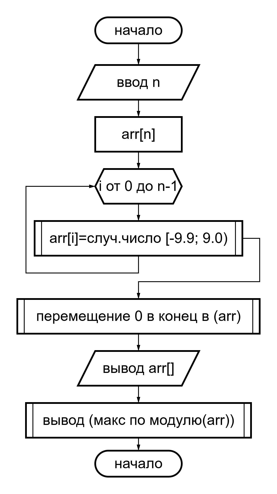

# Лаюороторная 10

## Задача 9
### Условие:
> В одномерном массиве, состоящем из n вещественных элементов, вычислить:
> - максимальный по модулю элемент массива;
> - преобразовать массив таким образом, чтобы элементы, равные нулю, располагались после всех остальных.

### Решение
#### 2. Блок схема
> 
